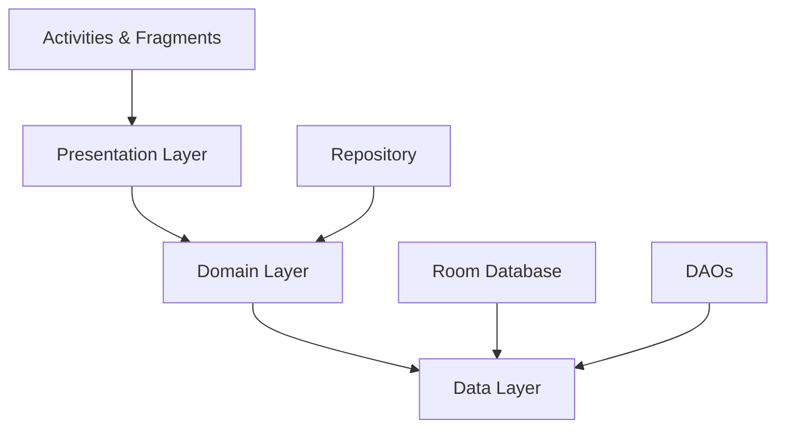

# 🌍 XPerience

<div align="center">


**Explora, Aprende y Gana - Tu guía gamificada de experiencias locales**

[](https://android.com)
[](https://kotlinlang.org)
[](https://android-arsenal.com/api?level=24)
[](LICENSE)

</div>

---

## 📋 Descripción

**XPerience** es una aplicación móvil Android innovadora que transforma la exploración de lugares locales en una experiencia gamificada y emocionante. Los usuarios pueden descubrir ubicaciones cercanas, completar misiones interactivas, ganar puntos y subir de nivel mientras exploran su entorno.

La aplicación combina elementos de geolocalización, gamificación y gestión de perfiles para crear una experiencia única que motiva a los usuarios a salir, explorar y aprender sobre los lugares que los rodean.

---

## ✨ Características Principales

<table>
<tr>
<td width="50%">

### 🎮 Sistema de Gamificación
- **Sistema de puntos y niveles** progresivo
- **Misiones diarias** con recompensas
- **Logros desbloqueables** por exploración
- **Ranking de usuarios** competitivo

</td>
<td width="50%">

### 🗺️ Exploración de Lugares
- **Descubrimiento de lugares** cercanos
- **Información detallada** de cada ubicación
- **Categorización** por tipos de lugares
- **Marcado de lugares visitados**

</td>
</tr>
<tr>
<td width="50%">

### 👤 Gestión de Perfil
- **Perfil personalizable** con avatar
- **Estadísticas detalladas** de progreso
- **Historial de visitas** y misiones
- **Sistema de autenticación** seguro

</td>
<td width="50%">

### 🎁 Sistema de Recompensas
- **Tienda de recompensas** canjeables
- **Puntos acumulables** por actividades
- **Incentivos exclusivos** por logros
- **Seguimiento de recompensas** obtenidas

</td>
</tr>
</table>

---

## 🛠️ Tecnologías Utilizadas

<table>
<tr>
<th>Categoría</th>
<th>Tecnología</th>
<th>Versión</th>
<th>Propósito</th>
</tr>
<tr>
<td><b>Lenguaje</b></td>
<td>Kotlin</td>
<td>1.9.23</td>
<td>Lenguaje principal de desarrollo</td>
</tr>
<tr>
<td><b>Base de Datos</b></td>
<td>Room Database</td>
<td>2.6.1</td>
<td>Persistencia local de datos</td>
</tr>
<tr>
<td><b>Procesamiento</b></td>
<td>KSP</td>
<td>1.9.23-1.0.19</td>
<td>Generación de código en tiempo de compilación</td>
</tr>
<tr>
<td><b>UI Framework</b></td>
<td>Material Design 3</td>
<td>1.13.0</td>
<td>Componentes de interfaz moderna</td>
</tr>
<tr>
<td><b>Android Core</b></td>
<td>AndroidX</td>
<td>1.17.0</td>
<td>Bibliotecas de compatibilidad</td>
</tr>
<tr>
<td><b>View Binding</b></td>
<td>ViewBinding</td>
<td>-</td>
<td>Enlace de vistas tipo-seguro</td>
</tr>
<tr>
<td><b>Ubicación</b></td>
<td>Android Location Services</td>
<td>-</td>
<td>Servicios de geolocalización</td>
</tr>
<tr>
<td><b>Build System</b></td>
<td>Gradle (Kotlin DSL)</td>
<td>8.13.1</td>
<td>Sistema de construcción y gestión de dependencias</td>
</tr>
</table>

---

## 🏗️ Arquitectura del Proyecto

```
XPerience_AppFinal/
│
├── 📱 app/
│   ├── src/
│   │   ├── main/
│   │   │   ├── java/com/example/xperience_appfinal/
│   │   │   │   ├── 🎯 Activities
│   │   │   │   │   ├── AuthActivity.kt          # Gestión de autenticación
│   │   │   │   │   └── HomeActivity.kt          # Actividad principal
│   │   │   │   │
│   │   │   │   ├── 📄 Fragments
│   │   │   │   │   ├── LoginFragment.kt         # Login de usuario
│   │   │   │   │   ├── RegisterFragment.kt      # Registro de usuario
│   │   │   │   │   ├── HomeFragment.kt          # Pantalla principal
│   │   │   │   │   ├── ExploreFragment.kt       # Exploración de lugares
│   │   │   │   │   ├── MissionsFragment.kt      # Misiones y desafíos
│   │   │   │   │   └── ProfileFragment.kt       # Perfil de usuario
│   │   │   │   │
│   │   │   │   ├── 💾 database/
│   │   │   │   │   └── AppDatabase.kt           # Configuración Room DB
│   │   │   │   │
│   │   │   │   ├── 📊 model/
│   │   │   │   │   ├── DataClasses.kt           # Entidades de datos
│   │   │   │   │   ├── Daos.kt                  # Data Access Objects
│   │   │   │   │   ├── Repository.kt            # Repositorio principal
│   │   │   │   │   └── MockRepository.kt        # Datos de prueba
│   │   │   │   │
│   │   │   │   └── XperienceApp.kt              # Clase Application
│   │   │   │
│   │   │   ├── res/
│   │   │   │   ├── layout/                      # Archivos de diseño XML
│   │   │   │   ├── drawable/                    # Recursos gráficos
│   │   │   │   ├── values/                      # Strings, colores, estilos
│   │   │   │   └── xml/                         # Configuraciones XML
│   │   │   │
│   │   │   └── AndroidManifest.xml              # Configuración de la app
│   │   │
│   │   ├── androidTest/                         # Tests instrumentados
│   │   └── test/                                # Tests unitarios
│   │
│   └── build.gradle.kts                         # Configuración del módulo
│
├── gradle/                                      # Configuración Gradle
│   ├── libs.versions.toml                       # Catálogo de versiones
│   └── wrapper/
│
├── build.gradle.kts                             # Configuración del proyecto
└── settings.gradle.kts                          # Configuración de módulos
```

### 🎨 Patrón de Arquitectura

La aplicación sigue una **arquitectura en capas** con los siguientes componentes:



| Capa | Responsabilidad |
|------|----------------|
| **Presentation** | Activities, Fragments, ViewBinding - Interfaz de usuario |
| **Domain** | Repository - Lógica de negocio y gestión de datos |
| **Data** | Room Database, DAOs, Entities - Persistencia de datos |

---

## 🔑 Componentes Clave

### 📦 Entidades de Datos (Room Entities)

<table>
<tr>
<th>Entidad</th>
<th>Descripción</th>
<th>Campos Principales</th>
</tr>
<tr>
<td><code>User</code></td>
<td>Información del usuario</td>
<td>id, name, points, level, visitedPlaces, completedMissions</td>
</tr>
<tr>
<td><code>Place</code></td>
<td>Lugares explorables</td>
<td>id, title, description, pointsAwarded, latitude, longitude</td>
</tr>
<tr>
<td><code>Mission</code></td>
<td>Misiones y desafíos</td>
<td>id, title, description, pointsReward, currentProgress</td>
</tr>
<tr>
<td><code>Reward</code></td>
<td>Recompensas canjeables</td>
<td>id, title, cost, iconResId</td>
</tr>
</table>

### 🎯 Actividades y Fragmentos

- **`AuthActivity`**: Gestiona el flujo de autenticación (login/registro)
- **`HomeActivity`**: Contenedor principal de navegación entre fragmentos
- **`HomeFragment`**: Dashboard con resumen de estadísticas y accesos rápidos
- **`ExploreFragment`**: Visualización y exploración de lugares cercanos
- **`MissionsFragment`**: Listado de misiones activas y completadas
- **`ProfileFragment`**: Perfil de usuario con estadísticas y configuración

### 💾 Base de Datos

**Room Database** con las siguientes características:
- ✅ Persistencia local offline-first
- ✅ Queries tipo-seguras con Kotlin
- ✅ Migración automática de esquemas
- ✅ Soporte para coroutines (Room KTX)

---

## 📋 Requisitos de Entorno de Desarrollo

### Requisitos del Sistema

<table>
<tr>
<th>Componente</th>
<th>Versión Mínima</th>
<th>Recomendada</th>
</tr>
<tr>
<td><b>Android Studio</b></td>
<td>Hedgehog (2023.1.1)</td>
<td>Ladybug o superior</td>
</tr>
<tr>
<td><b>JDK</b></td>
<td>11</td>
<td>17</td>
</tr>
<tr>
<td><b>Android SDK</b></td>
<td>API 24 (Android 7.0)</td>
<td>API 36 (Android 15)</td>
</tr>
<tr>
<td><b>Gradle</b></td>
<td>8.0</td>
<td>8.13.1</td>
</tr>
<tr>
<td><b>Kotlin</b></td>
<td>1.9.0</td>
<td>1.9.23</td>
</tr>
</table>

### Especificaciones de la App

| Característica | Valor |
|---------------|-------|
| **Min SDK** | 24 (Android 7.0 Nougat) |
| **Target SDK** | 36 (Android 15) |
| **Compile SDK** | 36 |
| **Version Code** | 1 |
| **Version Name** | 1.0 |

### Permisos Requeridos

```xml
<uses-permission android:name="android.permission.ACCESS_FINE_LOCATION" />
<uses-permission android:name="android.permission.ACCESS_COARSE_LOCATION" />
```

---

## 🚀 Instalación y Configuración

### 1️⃣ Clonar el Repositorio

```bash
git clone https://github.com/jessusgarciar/XPerience.git
cd XPerience
```

### 2️⃣ Abrir en Android Studio

1. Abre **Android Studio**
2. Selecciona `File > Open`
3. Navega hasta el directorio del proyecto
4. Espera a que Gradle sincronice las dependencias

### 3️⃣ Configurar el SDK

1. Ve a `File > Project Structure > Project`
2. Verifica que **JDK** esté configurado en versión 11 o superior
3. Verifica que **Android SDK** incluya API 24-36

### 4️⃣ Sincronizar Gradle

```bash
./gradlew clean build
```

O desde Android Studio:
- Haz clic en `Sync Project with Gradle Files`

### 5️⃣ Ejecutar la Aplicación

**Opción A: Emulador**
1. Crea un AVD (Android Virtual Device) con API 24+
2. Haz clic en el botón `Run` (▶️)

**Opción B: Dispositivo Físico**
1. Habilita las **Opciones de Desarrollador** en tu dispositivo
2. Activa **Depuración USB**
3. Conecta el dispositivo y selecciónalo en Android Studio
4. Haz clic en `Run`

### 6️⃣ Generar APK de Producción

```bash
./gradlew assembleRelease
```

El APK estará en: `app/build/outputs/apk/release/`

---

## 📱 Uso de la Aplicación

### 🔐 Autenticación

1. **Primer Inicio**: Crea una cuenta con tus datos personales
2. **Login**: Accede con tus credenciales guardadas
3. **Perfil**: Personaliza tu avatar y nombre de usuario

### 🗺️ Explorar Lugares

1. Navega al tab **"Explorar"**
2. Visualiza lugares cercanos en lista o mapa
3. Toca un lugar para ver detalles
4. Marca lugares como visitados para ganar puntos

### 🎯 Completar Misiones

1. Ve a la sección **"Misiones"**
2. Revisa las misiones disponibles
3. Completa los objetivos requeridos
4. Cobra tus recompensas en puntos

### 📊 Seguimiento de Progreso

1. Accede a tu **"Perfil"**
2. Revisa estadísticas:
   - Total de puntos
   - Nivel actual
   - Lugares visitados
   - Misiones completadas

### 🎁 Canjear Recompensas

1. Acumula puntos mediante exploración y misiones
2. Navega a la sección de recompensas
3. Canjea tus puntos por beneficios exclusivos

---

## 🗺️ Roadmap y Mejoras Futuras

### 📅 Versión 1.1 (Q1 2026)

- [ ] **Integración con Google Maps** para visualización mejorada
- [ ] **Sistema de amigos** y perfiles sociales
- [ ] **Notificaciones push** para misiones cercanas
- [ ] **Modo oscuro** completo
- [ ] **Soporte multiidioma** (Español, Inglés, Portugués)

### 📅 Versión 1.2 (Q2 2026)

- [ ] **Realidad Aumentada (AR)** para exploración inmersiva
- [ ] **Chat en tiempo real** entre usuarios
- [ ] **Sistema de logros** con insignias desbloqueables
- [ ] **Leaderboards globales** y por región
- [ ] **Integración con redes sociales** para compartir logros

### 📅 Versión 2.0 (Q3 2026)

- [ ] **Backend con API REST** (Firebase o Node.js)
- [ ] **Sincronización en la nube** de progreso
- [ ] **Eventos especiales** y misiones temporales
- [ ] **Sistema de monetización** (IAPs para contenido premium)
- [ ] **Marketplace de recompensas** con partners locales
- [ ] **Modo offline mejorado** con caché inteligente

### 🔮 Futuro a Largo Plazo

- [ ] **Machine Learning** para recomendaciones personalizadas
- [ ] **Gamificación avanzada** con clanes y competencias
- [ ] **Programa de afiliados** con negocios locales
- [ ] **App para iOS** (SwiftUI)
- [ ] **Dashboard web** para análisis de estadísticas
- [ ] **API pública** para desarrolladores third-party

---

## 🤝 Contribuciones

Las contribuciones son bienvenidas. Para cambios importantes:

1. Fork el proyecto
2. Crea una rama para tu feature (`git checkout -b feature/AmazingFeature`)
3. Commit tus cambios (`git commit -m 'Add some AmazingFeature'`)
4. Push a la rama (`git push origin feature/AmazingFeature`)
5. Abre un Pull Request

---

## 👤 Autor

**Jesús García**
- GitHub: [@jessusgarciar](https://github.com/jessusgarciar)
- Proyecto: [XPerience](https://github.com/jessusgarciar/XPerience)